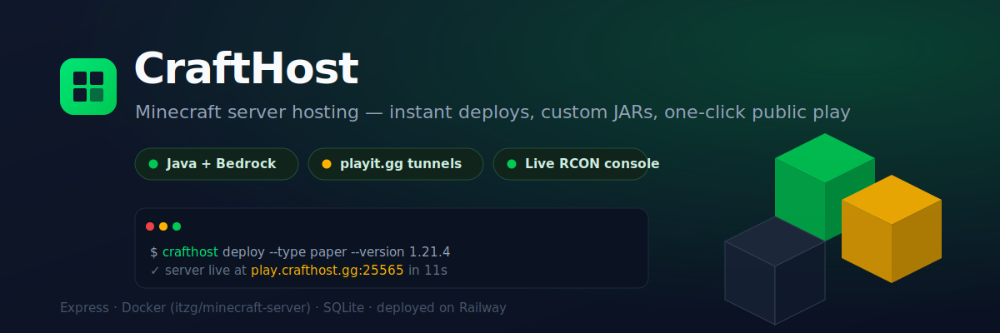
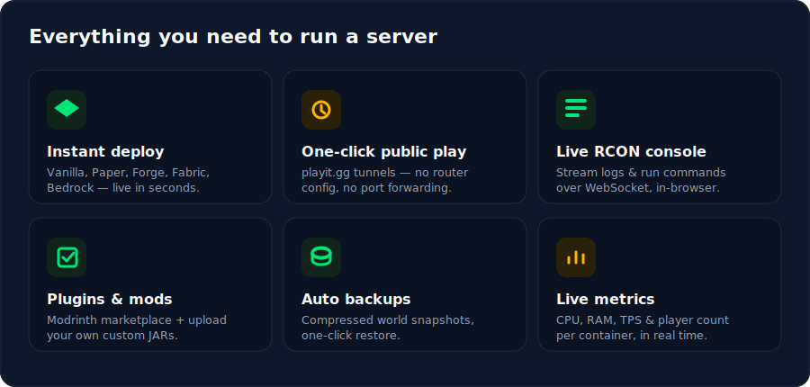
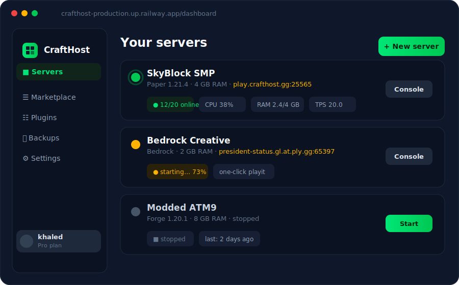
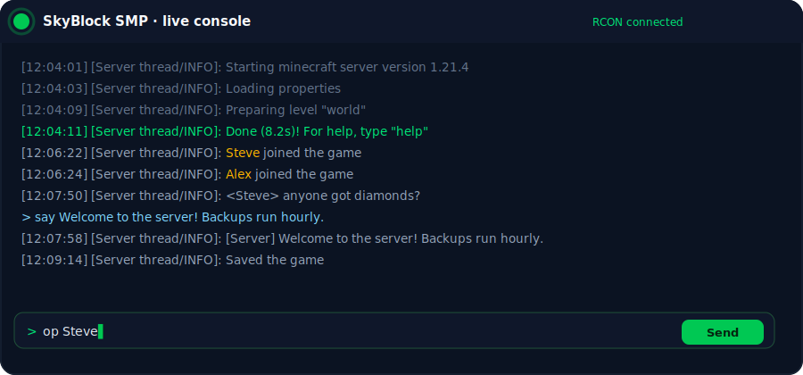
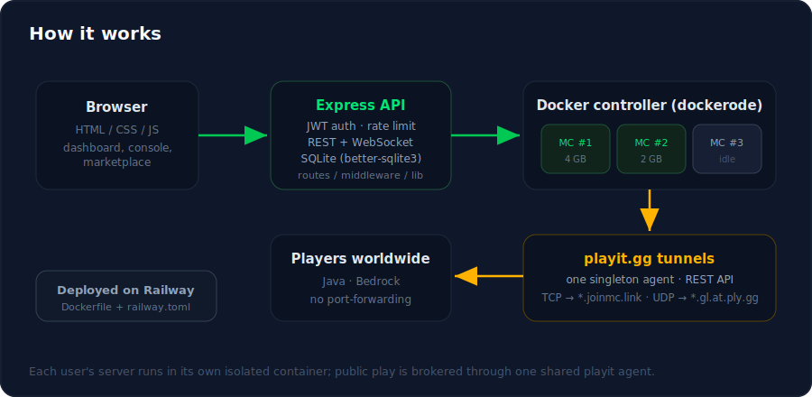

<div align="center">



# CraftHost

**Minecraft server hosting platform** — instant deploys, custom JARs, mod support, and one-click public play for both **Java** and **Bedrock**.

[](https://crafthost-production.up.railway.app)


</div>

---

## ✨ Features



- **Instant deploy** — Vanilla, Paper, Forge, Fabric and Bedrock servers spun up in seconds.
- **One-click public play** — players connect from anywhere through **playit.gg** tunnels; no port-forwarding, no router config. Java over `*.joinmc.link`, Bedrock over `*.gl.at.ply.gg`.
- **Live RCON console** — stream server logs and run commands straight from the browser over WebSocket.
- **Plugins & mods** — search and install from the **Modrinth** marketplace, or upload your own custom JARs.
- **Auto backups** — compressed world snapshots with one-click restore.
- **Live metrics** — per-container CPU, RAM, TPS and player count in real time.
- **Isolated & secure** — every server runs in its own Docker container; JWT auth, rate limiting and Helmet on the API.

---

## 🖥️ The dashboard



## 🎮 Live console (RCON over WebSocket)



---

## 🏗️ Architecture



Each user's server is an isolated `itzg/minecraft-server` container managed through **dockerode**. Public connectivity is brokered by a **single shared playit agent** that maps every server's TCP/UDP tunnel — so players join without any networking setup on their end.

---

## 🚀 Quick start

```bash
git clone https://github.com/khaledq84ever/crafthost
cd crafthost
cp .env.example .env      # set JWT_SECRET, ports, playit keys
npm install
npm run init-db           # create the SQLite schema
npm start
```

Open **http://localhost:4000** (or the `PORT` in your `.env`).

> Requires Docker running locally — the API talks to the Docker socket to manage server containers.

---

## 📁 Project structure

```
crafthost/
├── backend/             Express API, Docker controller, auth, billing
│   ├── routes/          auth · servers · versions · jars · files · plugins · backups · plans · modrinth
│   ├── middleware/      auth · rate limit · error handlers
│   ├── lib/             docker-controller · rcon · playit · public-tunnel · backup · auto-fix · modrinth
│   └── db/              SQLite schema + init (better-sqlite3)
├── frontend/            Static HTML/CSS/JS (served by Express, mobile-first, RTL+LTR)
│   ├── css/  js/  assets/
│   └── dashboard · console · marketplace · jars · files · pricing · settings · status
├── jars/                Cached server JARs (vanilla, paper, …)
├── uploads/             User-uploaded custom JARs
├── data/                SQLite DB + per-server world data
└── backups/             Compressed world backups
```

---

## 🧱 Stack

| Layer | Tech |
| --- | --- |
| **Backend** | Node.js + Express + better-sqlite3 + JWT auth + dockerode |
| **Realtime** | `ws` (WebSocket) + `rcon-client` for live console |
| **Containers** | `itzg/minecraft-server`, one isolated container per server |
| **Tunnels** | playit.gg REST API — one singleton agent, TCP + UDP |
| **Frontend** | Vanilla HTML/CSS/JS (mobile-first, RTL + LTR) |
| **Deploy** | Railway (`Dockerfile` + `railway.toml`) |

---

## 🎨 Brand

| Token | Value |
| --- | --- |
| Emerald | `#00C853` |
| Dark slate | `#0F172A` |
| Gold | `#FFB300` |
| Fonts | Inter (English) · Tajawal (Arabic) |

---

<div align="center">
<sub>Built with Node, Express &amp; Docker · deployed on Railway</sub>
</div>
